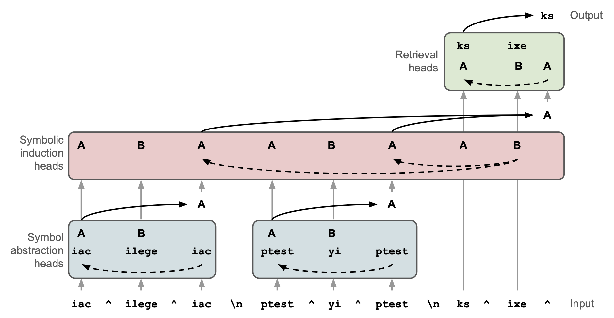
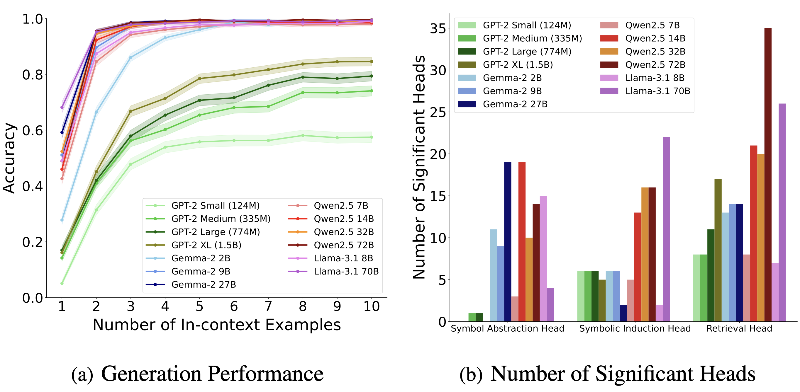
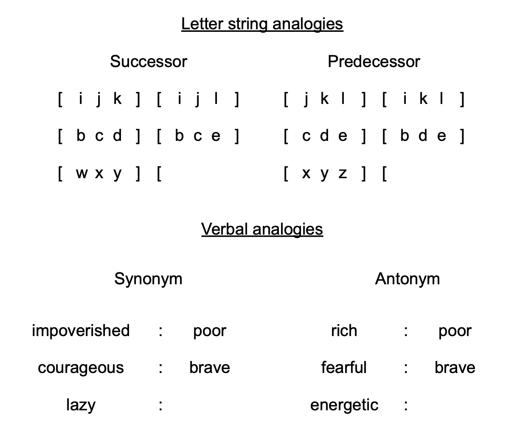

<h1 align='center' style="text-align:center; font-weight:bold; font-size:2.0em;letter-spacing:2.0px;"> Emergent Symbolic Mechanisms<br> Support Abstract Reasoning in LLMs </h1>

<p align='center' style="text-align:center;font-size:1.25em;"> 
    <a href="https://scholar.google.com/citations?user=ASZWVzEAAAAJ&hl=en" target="_blank" style="text-decoration: none;">Yukang Yang</a>, &nbsp; 
    <a href="https://scholar.google.com/citations?hl=en&user=QS1P0NYAAAAJ" target="_blank" style="text-decoration: none;"> Declan Campbell</a>, &nbsp;  
    <a href="https://hackyhuang.github.io" target="_blank" style="text-decoration: none;">Kaixuan Huang</a>, &nbsp; 
    <a href="https://mwang.princeton.edu/" target="_blank" style="text-decoration: none;">Mengdi Wang</a>, &nbsp; 
    <a href="https://pni.princeton.edu/people/jonathan-cohen" target="_blank" style="text-decoration: none;">Jonathan Cohen</a>, &nbsp; 
    <a href="https://scholar.google.nl/citations?user=WCmrJoQAAAAJ&hl=en" target="_blank" style="text-decoration: none;">Taylor Webb</a>*
    <br/>  
Princeton University, Microsoft Research (* Corresponding Author)
</p>


<p align='center';>
<b>
<em>ICML 2025</em> <br> 
</b>
</p>

<p align='center' style="text-align:center;font-size:2.5 em;">
<b>
    <a href="https://arxiv.org/abs/2502.20332" target="_blank" style="text-decoration: none;">arXiv</a>&nbsp;
</b>
</p>

<div align="center">

<div align="left">
<p><b>Emergent Three-Stage Symbolic Processing Mechanisms</b>. Example depicts architecture as applied to an algebraic rule induction task (ABA rule in the figure). (1) <strong><em>Symbol abstraction heads</em></strong> identify relations between input tokens and, based on these relations, represent the tokens using a consistent set of abstract variables aligned with their role in the relations. (2) <strong><em>Symbolic induction heads</em></strong> perform sequence induction over abstract variables (i.e., they predict the next variable based on the sequence observed in the previous in-context examples). (3) <strong><em>Retrieval heads</em></strong> predict the next token by retrieving the value associated with the predicted abstract variable.</p>
</div>

<div align="left">

## News

**2025.07.17** The code for main analyses on identity rule tasks are released. More information about other analyses is coming!

## :wrench: Installation

```
git clone --recurse-submodules https://github.com/yukang123/LLMSymbMech.git
cd LLMSymbMech
conda env create -f environment.yaml
conda activate LLMSymbMech
``` 
Two GPUs with 80GB of memory are needed for experiments on Llama3.1-70B and Qwen2.5 72B. H100 is perferred over A100. Only one GPU is needed for other smaller models.

[Important]
Since Llama3.1 is a gated model, please replace ```HF_TOKEN``` in ```utils.py``` with your own HF token after creating one under Access Tokens in your HF account

## 1. Identity Rule Tasks 

Algebraic Rule Induction Task: (k in-context examples, k=2 in the below example)

**Rule ABA**: iac ^ ilege ^ iac \n ptest ^ yi ^ ptest \n ks ^ ixe ^ --> ks

**Rule ABB**: ilege ^ iac ^ iac \n yi ^ ptest ^ ptest \n ixe ^ ks ^ --> ks

Switch to the subfolder:
```
cd tasks/identity_rules
```
**A. Model Performance Evaluation**

Test the model performance on $N$-shot prompts for both rule ABA and rule ABB.

Specify the ```rule```, ```model_type```, and the number of in-context examples ```n_shot``` as follows:
```
rule=ABA 
model_type=Llama-3.1-70B
n_shot=2
```
You may also load generation configs which are stored in the ```generation_config``` folder to specify different sampling strategies. We used greedy sampling strategy for LLaMa 3.1 70B. Then run the following command:
```
python eval.py --rule $rule --model_type $model_type --prompt_num 500  --in_context_example_num $n_shot --sample_size 4 --acc_threshold 0.9 --load_generation_config --sample_remark _greedy
```

Please refer to ```eval.py``` for more details about the meaning of the parameters and run the script for **13** models of **4** model families.

**B. Causal Mediation Analyses (CMA)**  
There are two types of context pairs, ```abstract``` and ```token```. ```abstract``` context pairs are used for identifying symbol abstraction heads and symbolic induction heads while ```token``` context pairs are applied for retrieval heads. Each pair comprises of a ```base_context``` and an ```exp_context```, and we patch the activations from ```base_context``` to ```exp_context```.

Specify the ```base_rule```, i.e., the rule of the base context from which the activations are patched, and other parameters as follows:
```
base_rule=ABA 
min_valid_sample_num=20
seed=0 ## try 5 different seeds [0,1,2,3,4] to get the average results over 100 context pairs
```
Run the command for ```symbol abstraction heads``` in Llama-3.1-70B:
```
python cma.py --activation_name z --context_type abstract --token_pos_list 4 10 --in_context_example_num 10 --base_rule $base_rule --model_type Llama-3.1-70B --seed $seed --min_valid_sample_num $min_valid_sample_num --low_prob_threshold 0.9 --do_shuffle --ungroup_grouped_query_attention --prompt_num 1000  --eval_metric gen_acc --load_generation_config --sample_size 4 --n_devices 2 --device_map cpu --device cuda 
```
Run the command for ```symbolic induction heads``` in Llama-3.1-70B:
```
python cma.py --activation_name z --context_type abstract --token_pos_list -1 --in_context_example_num 10 --base_rule $base_rule --model_type Llama-3.1-70B --seed $seed --min_valid_sample_num $min_valid_sample_num --low_prob_threshold 0.9 --do_shuffle --ungroup_grouped_query_attention --prompt_num 1000  --eval_metric gen_acc --load_generation_config --sample_size 4 --n_devices 2 --device_map cpu --device cuda 
```
Run the command for ```retrieval heads``` in Llama-3.1-70B:
```
python cma.py --activation_name z --context_type token --token_pos_list -1 --in_context_example_num 10 --base_rule $base_rule --model_type Llama-3.1-70B --seed $seed --min_valid_sample_num $min_valid_sample_num --low_prob_threshold 0.9 --do_shuffle --ungroup_grouped_query_attention --prompt_num 1000  --eval_metric gen_acc --load_generation_config --sample_size 4 --n_devices 2 --device_map cpu --device cuda 
```
Check the ```results/identity_rules/cma``` for the causal mediation scores of all the attention heads. We did permutation statistical tests to identify the significant heads for each head type. Here are the significant heads found in Llama-3.1-70B: 

<div align="center">

<div align="left">

For similar analyses on other models, please refer to ```run_identity.sh``` for the commands and review the ```cma.py``` for more information about parameters and methods. We found similar three-stage symbolic processing mechanisms in 3 out of 4 model families with GPT-2 as an exception. 

<div align="center">

<div align="left">


**C. Representation Similarity Analyses (RSA)** 

We analyze the pair-wise similarity for the embedding (```output, key, query, value```) of these significant heads and compare the similarity matrices with expected similarity matrix for abstract variables (```pearson correlation```) to testify whether the embedding represents abstract variables. We also compare against the expected token similarity matrix among the literal tokens. By comparing the correlations with these two expected similarity matrices, we confirmed our hypotheses about the representation of these attention head embeddings.

One example run is:
```
prompt_num=40
python rsa.py --do_shuffle --seed 1234 --only_for_significant_heads --head_type symbol_abstraction_head --cmp_with_abstract --sel_pos_list 4 --in_context_example_num 2 --act_list z --add_swap_1_2_question --prompt_num $prompt_num --plot_hand_code --plot_rsa --transpose --low_sim 0 --token_set_file datasets/llama31_70B_correct_common_tokens_0.9_1378.txt --n_devices 2 --model_type Llama-3.1-70B # --save_similarity 
```
More commands for full analyses on four embedding types will be added into ```run_identity.sh```.


**D. Ablation Studies** 

We conducted cumulative ablation studies by increasing the number of ablated heads gradually. We ranked all the heads according to their causal mediation scores and started ablating the top ones. As a control condition, we chose the same number of heads which have the lowest causal scores in the same layer. We also added a random control group in which we randomly ablated attention heads.

One example run for symbol abstraction head is:
```
rule=ABA # ABA or ABB
min_valid_sample_num=40
seed=1000 ## please specify the seed which is different form the seeds used in CMA
random_times=10
```

```
python ablation.py --model_type Llama-3.1-70B --head_type symbol_abstraction_head --step_size 2 --adaptive_step_size --rule $rule --prompt_file_for_causal_scores_exp "datasets/cma_scores/llama31_70B/symbol_abstraction_head/base_${rule}_prompt_for_cma_100.txt" --token_pos_list 4 10 --activation_name z --min_valid_sample_num $min_valid_sample_num --load_generation_config  --do_shuffle --seed $seed --prompt_num 1000 --low_prob_threshold 0.9 --n_devices 2 --token_set_file datasets/llama31_70B_correct_common_tokens_0.9_1378.txt  --in_context_example_num 2 --eval_metric gen_acc
```
More commands for full analyses could be found in ```run_identity.sh```. Please refer to ```ablation.py``` for more details.


<!-- **E. Attention Analyses**  -->

<!-- **F. Abstract Symbol Decoding** -->

<div align="center">

<div align="left">

## 2. Letter String Analogy Tasks [Incoming]

**A. Model Performance Evaluation**

**B. Causal Mediation Analyses** 

## 3. Verbal Analogy Tasks [Incoming]

**A. Model Performance Evaluation**

**B. Causal Mediation Analyses** 

## :heart: Acknowledgement
We would like to express our sincere thanks to the contributors of [TransformerLens](https://github.com/TransformerLensOrg/TransformerLens), [transformers](https://huggingface.co/docs/transformers) and [HuggingFace](https://huggingface.co) teams. Our code was built on these open-sourced packages.


## :e-mail: Contact

For help or issues about the code, please email Yukang Yang (yy1325@princeton.edu), and Taylor Webb (taylor.w.webb@gmail.com
) or submit a GitHub issue.


## :mailbox_with_mail: Citation
If you find this code useful in your research, please consider citing:
```
@article{yang2025emergent,
  title={Emergent symbolic mechanisms support abstract reasoning in large language models},
  author={Yang, Yukang and Campbell, Declan and Huang, Kaixuan and Wang, Mengdi and Cohen, Jonathan and Webb, Taylor},
  journal={arXiv preprint arXiv:2502.20332},
  year={2025}
}

```


